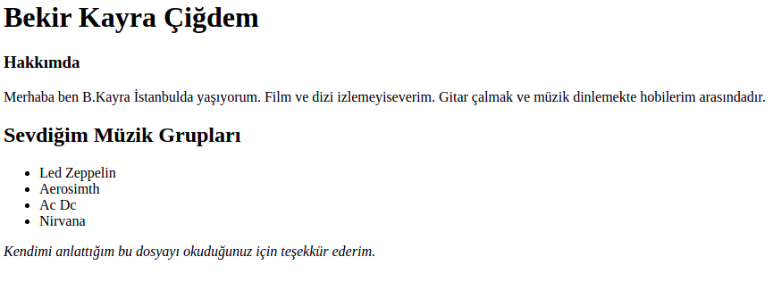

# Kodluyoruz Html Odevler
Bu repo [Kodluyoruz](https://www.kodluyoruz.org) Front-End Eğitiminde oluşturduğumuz ilk odev. İçerisinde bir adet README dosyası, bir adet de index.html ve bir adet de png dosyası barındırıyor.



## Installation
Öncelikle projeyi clonelayın.
`git clone https://github.com/BekirKayraCigdem/kodluyoruzHtmlOdevler.git`
## Usage
Projeyi cloneladıktan sonra Visual Studio Code programında açınız.
Linux için:
```
cd kodluyoruzHtmlOdevler
code .
```
## License
[MIT](https://choosealicense.com/licenses/mit/)